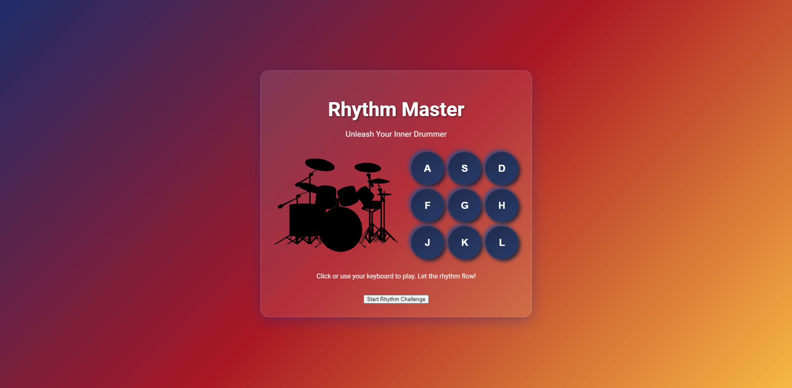

# Rhythm Master

Rhythm Master is an interactive web-based drum kit application. Users can play various drum sounds using keyboard keys or on-screen buttons, creating an engaging rhythm experience.

  

   
   

  <h2>🎵 Unleash Your Inner Drummer 🥁</h2>

  

## Features

- 9 different drum sounds
- Keyboard and mouse interaction
- Custom animations for each key
- Responsive design
- "Rhythm Challenge" mini-game

## How to Use

1. Open the page
2. Use the A, S, D, F, G, H, J, K, L keys on your keyboard or click the on-screen buttons to play drum sounds
3. Click the "Start Rhythm Challenge" button to start the mini-game
4. Repeat the played rhythm to advance levels

## Technologies

- HTML5
- CSS3
- JavaScript (ES6+)