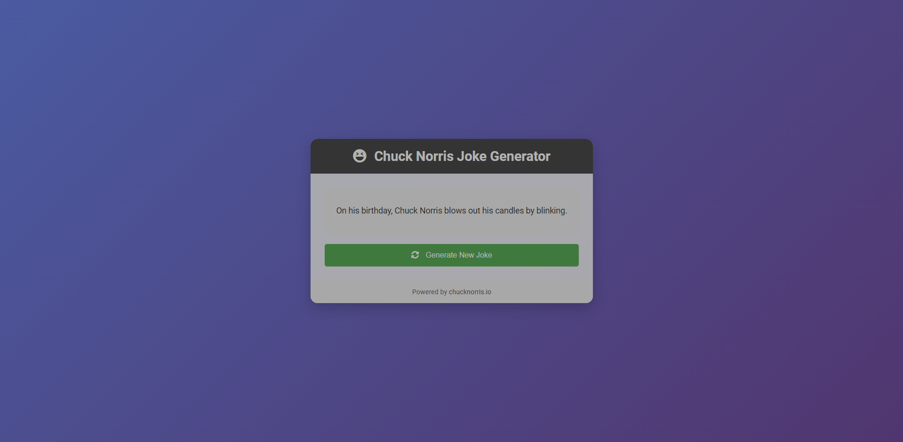

# Chuck Norris Joke Generator

This project is a simple web application that generates random Chuck Norris jokes using the [Chuck Norris IO API](https://api.chucknorris.io/).

  

   
   

  <h2>🚀 Experience the Future of Task Management 🚀</h2>

  

## Features

- Generates random Chuck Norris jokes
- Clean and responsive design
- Easy to use interface

## Technologies Used

- HTML5
- CSS3
- JavaScript (ES6+)
- Chuck Norris IO API