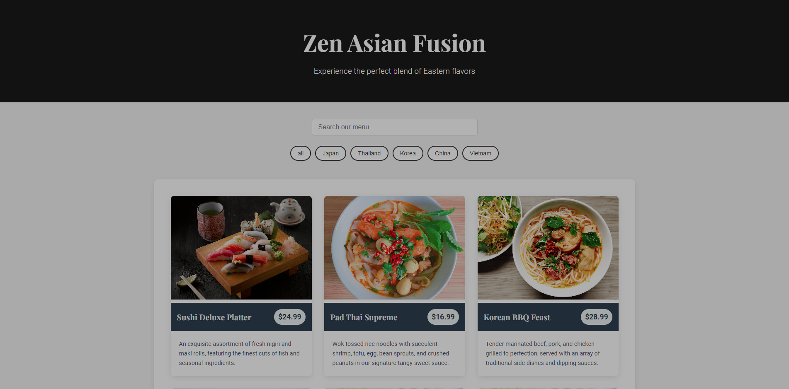

# Zen Asian Fusion Restaurant Menu

This project is a dynamic and responsive web application for Zen Asian Fusion Restaurant's menu. It allows users to view menu items, filter by cuisine type, and search for specific dishes.

  

## Features

- Responsive design that works on desktop and mobile browsers
- Dynamic menu item display
- Filter menu items by cuisine category
- Search functionality to find specific dishes
- Modern and attractive UI design

## Technologies Used

- HTML5
- CSS3
- JavaScript (ES6+)
- Google Fonts
- Font Awesome Icons