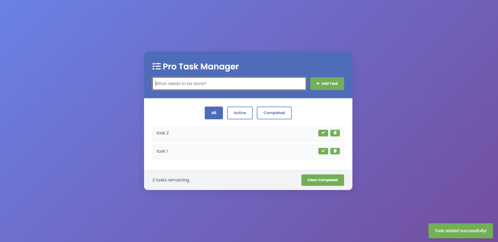

# Pro Task Manager

Pro Task Manager is a sleek, modern, and feature-rich to-do list application built with HTML, CSS, and JavaScript. It offers an intuitive user interface for managing daily tasks efficiently.

  

   
   

  <h2>🚀 Experience the Future of Task Management 🚀</h2>

  

## Features

- Add, complete, and delete tasks
- Filter tasks (All, Active, Completed)
- Local storage for persistent data
- Responsive design for various screen sizes
- Clear completed tasks functionality
- Task counter
- Toast notifications for user actions